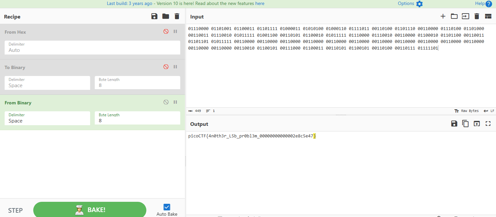

# Investigate reversing 3
## 解説
`Investigate Reversing 2`同様にbmpファイルとバイナリが与えられた.\
デコンパイルで確認すると、

```C

undefined8 main(void)

{
  size_t sVar1;
  long in_FS_OFFSET;
  char origin;
  char butikomi;
  int local_7c;
  int i;
  uint j;
  int k;
  undefined4 local_6c;
  int value;
  int check;
  FILE *flag.txt;
  FILE *original.bmp;
  FILE *encoded.bmp;
  char flag [56];
  long local_10;
  
  local_10 = *(long *)(in_FS_OFFSET + 0x28);
  local_6c = 0;
  flag.txt = fopen("flag.txt","r");
  original.bmp = fopen("original.bmp","r");
  encoded.bmp = fopen("encoded.bmp","a");
  if (flag.txt == (FILE *)0x0) {
    puts("No flag found, please make sure this is run on the server");
  }
  if (original.bmp == (FILE *)0x0) {
    puts("No output found, please run this on the server");
  }
  sVar1 = fread(&origin,1,1,original.bmp);
  local_7c = (int)sVar1;
  value = 0x2d3;
  for (i = 0; i < value; i = i + 1) {
    fputc((int)origin,encoded.bmp);
    sVar1 = fread(&origin,1,1,original.bmp);
    local_7c = (int)sVar1;
  }
  sVar1 = fread(flag,0x32,1,flag.txt);
  check = (int)sVar1;
  if (check < 1) {
    puts("Invalid Flag");
                    /* WARNING: Subroutine does not return */
    exit(0);
  }
  for (j = 0; (int)j < 100; j = j + 1) {
    if ((j & 1) == 0) {
      for (k = 0; k < 8; k = k + 1) {
        butikomi = codedChar(k,(int)flag[(int)j / 2],(int)origin);
        fputc((int)butikomi,encoded.bmp);
        fread(&origin,1,1,original.bmp);
      }
    }
    else {
      fputc((int)origin,encoded.bmp);
      fread(&origin,1,1,original.bmp);
    }
  }
  while (local_7c == 1) {
    fputc((int)origin,encoded.bmp);
    sVar1 = fread(&origin,1,1,original.bmp);
    local_7c = (int)sVar1;
  }
  fclose(encoded.bmp);
  fclose(original.bmp);
  fclose(flag.txt);
  if (local_10 == *(long *)(in_FS_OFFSET + 0x28)) {
    return 0;
  }
                    /* WARNING: Subroutine does not return */
  __stack_chk_fail();
}

```

初めの`0x2d2`まではoriginalの情報を書き込み、そこからflagを埋め込んでいくスタイルになっている。\
※`0x2d2`までの書き込みはbmpの0番地から始まるので注意!(色情報から始まるとか一言も書いてない)

しかし、このオフセットだと、制御情報のLSBにflagを埋め込むのだが果たして良いのか。 -> 別に良い

また、肝心の埋め込み方式についてだが、
```C
for (j = 0; (int)j < 100; j = j + 1) {
    if ((j & 1) == 0) {
      for (k = 0; k < 8; k = k + 1) {
        butikomi = codedChar(k,(int)flag[(int)j / 2],(int)origin);
        fputc((int)butikomi,encoded.bmp);
        fread(&origin,1,1,original.bmp);
      }
    }
    else {
      fputc((int)origin,encoded.bmp);
      fread(&origin,1,1,original.bmp);
    }
  }
```

`j`のLSBが0の時はflagの文字を2進数にしたものを0ビット目から埋め込んでいく方式、`j`のLSBが1の時は`original`の加工していない情報を1バイト書き込むという方式をとっている.\
`j`のLSBは0,1,0,1...と交互になるため、8バイト埋め込み -> 1バイト休み -> 8バイト埋め込み -> 1バイト休み　のような埋め込み形式にあるはずである。

よって以上の点に注意し、
```
000002d0: c000 8080 e000 80a1 0101 80a0 2100 80a1  ............!...
000002e0: 4001 81a0 6001 81a0 8000 81a1 a000 81a1  @...`...........
000002f0: c101 80a1 e100 80c1 0100 80c0 2001 80c0  ............ ...
00000300: 4000 81c0 6100 81c0 8000 81c1 a000 80c1  @...a...........
00000310: c000 81c1 e001 81e1 0100 80e0 2001 80e1  ............ ...
00000320: 4100 80e0 6001 81e1 8001 81e0 a000 80e0  A...`...........
00000330: c001 81e0 e000 c000 0100 c101 2100 c000  ............!...
00000340: 4000 c100 6101 c000 8101 c000 a101 c000  @...a...........
00000350: c000 c100 e001 c121 0000 c121 2101 c120  .......!...!!..
00000360: 4100 c020 6001 c120 8001 c020 a100 c120  A.. `.. ... ...
00000370: c101 c020 e000 c140 0000 c141 2000 c141  ... ...@...A ..A
00000380: 4101 c140 6100 c040 8000 c041 a101 c040  A..@a..@...A...@
00000390: c001 c040 e101 c160 0000 c060 2001 c160  ...@...`...` ..`
000003a0: 4000 c061 6000 c061 8100 c060 a001 c160  @..a`..a...`...`
000003b0: c101 c060 e101 c080 0101 c080 2001 c081  ...`........ ...
000003c0: 4100 c181 6000 c181 8101 c180 a100 c080  A...`...........
000003d0: c000 c081 e100 c0a0 0000 c0a0 2101 c0a0  ............!...
000003e0: 4000 c0a0 6001 c1a0 8000 c0a0 a000 c1a1  @...`...........
000003f0: c000 c0a0 e000 c0c1 0100 c0c0 2000 c0c0  ............ ...
00000400: 4101 c0c0 6000 c0c0 8001 c1c0 a000 f0fa  A...`...........
00000410: fe00 a5a1 a000 8080 8000 0001 ff00 00ff  ................
00000420: 0000 00fe ff01 fe00 0000 fe00 fe01 fffe  ................
00000430: 0000 fefe fe00 e9e9 e8e8 e8e8 e8e8 e8e9  ................
00000440: e9e8 e8e8 e8e9 e8e8 e9e9 e8e8 e8e9 e8e9  ................
00000450: e8e8 e9e9 e8e8 e8e8 e8e9 e9e9 e8e8 e8e9  ................
00000460: e9e8 e8e8 e9e9 e8e8 e9e8 e9e8 e9e9 e8e8  ................
00000470: e8e9 e8e9 e8e8 e9e9 e8e8 e8e8 e9e8 e9e9  ................
00000480: e8e8 e8e9 e9e9 e8e9 e9e8 e8e8 e9e8 e9e9  ................
00000490: e9e9 e9e8 e8e8 e8e8 e8e8 e8e8 e8e8 e8e8  ..
```
からLSBを読み取ると、

```
01110000 01101001 01100011 01101111 01000011 01010100 01000110 01111011 00110100 01101110 00110000 01110100 01101000 00110011 01110010 01011111 01001100 00110101 01100010 01011111 01110000 01110010 00110000 01100010 01101100 00110011 01101101 01011111 00110000 00110000 00110000 00110000 00110000 00110000 00110000 00110000 00110000 00110000 00110000 00110000 00110000 00110010 01100101 00111000 01100011 00110101 01100101 00110100 00110111 01111101
```
のバイナリを得ることができる。



よってflagを得た。`picoCTF{4n0th3r_L5b_pr0bl3m_00000000000002e8c5e47}`

## 感想
LSB埋め込みは色情報の部分にしか埋め込めないと思っていたが、制御情報のLSBにも埋め込めることに驚いた。\
確かに、色情報のアドレスから埋め込むとか一言も書いてないか...
