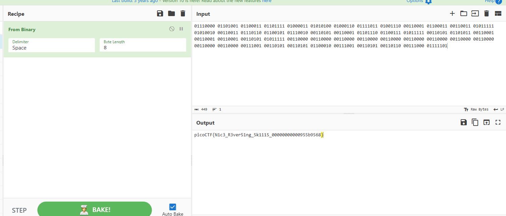

# Investigate reversing 4
## 解説
`Investigate Reversing 3`同様にbmpファイル（今回は5つ）とバイナリが与えられた.\
デコンパイルで確認すると、

```C

undefined8 main(void)

{
  size_t sVar1;
  undefined4 local_4c;
  undefined1 local_48 [52];
  int check;
  FILE *flag.txt;
  
  flag = local_48;
  local_4c = 0;
  flag_index = &local_4c;
  flag.txt = fopen("flag.txt","r");
  if (flag.txt == (FILE *)0x0) {
    puts("No flag found, please make sure this is run on the server");
  }
  sVar1 = fread(flag,0x32,1,flag.txt);
  check = (int)sVar1;
  if (check < 1) {
    puts("Invalid Flag");
                    /* WARNING: Subroutine does not return */
    exit(0);
  }
  fclose(flag.txt);
  encodeAll();
  return 0;
}


void encodeDataInFile(char *param_1,char *param_2)

{
  size_t sVar1;
  char original.bmp;
  char butikomi;
  int value;
  FILE *encoded.bmp;
  FILE *original;
  int k;
  int j;
  int i;
  int check;
  
  original = fopen(param_1,"r");
  encoded.bmp = fopen(param_2,"a");
  if (original != (FILE *)0x0) {
    sVar1 = fread(&original.bmp,1,1,original);
    check = (int)sVar1;
    value = 0x7e3;
    for (i = 0; i < value; i = i + 1) {
      fputc((int)original.bmp,encoded.bmp);
      sVar1 = fread(&original.bmp,1,1,original);
      check = (int)sVar1;
    }
    for (j = 0; j < 0x32; j = j + 1) {
      if (j % 5 == 0) {
        for (k = 0; k < 8; k = k + 1) {
          butikomi = codedChar(k,(int)*(char *)(*flag_index + flag),(int)original.bmp);
          fputc((int)butikomi,encoded.bmp);
          fread(&original.bmp,1,1,original);
        }
        *flag_index = *flag_index + 1;
      }
      else {
        fputc((int)original.bmp,encoded.bmp);
        fread(&original.bmp,1,1,original);
      }
    }
    while (check == 1) {
      fputc((int)original.bmp,encoded.bmp);
      sVar1 = fread(&original.bmp,1,1,original);
      check = (int)sVar1;
    }
    fclose(encoded.bmp);
    fclose(original);
    return;
  }
  puts("No output found, please run this on the server");
                    /* WARNING: Subroutine does not return */
  exit(0);
}


```
が見つかった。\
重要なのは`encodeDataInFile`関数の方で、中にflagの埋め込み方式が記述されている。

```C
for (j = 0; j < 0x32; j = j + 1) {
      if (j % 5 == 0) {
        for (k = 0; k < 8; k = k + 1) {
          butikomi = codedChar(k,(int)*(char *)(*flag_index + flag),(int)original.bmp);
          fputc((int)butikomi,encoded.bmp);
          fread(&original.bmp,1,1,original);
        }
        *flag_index = *flag_index + 1;
      }
      else {
        fputc((int)original.bmp,encoded.bmp);
        fread(&original.bmp,1,1,original);
      }
```

解析すると、`codedChar`関数は、前回までの問題と同じく、flagの2進数文字の0ビット目から7ビット目を取り出してLSBにぶち込む形を作る関数である。\
ここで重要なのが、`j`の値0-49がmod 5で割り切れる場合のみ、この埋め込みは発生するという点である。\
つまり、8バイト埋め込み(flagの1文字分) -> 4バイト休み -> 8バイト埋め込み -> 4バイト休み　という動作で、文字の埋め込みを10回行うことになる。\
これだとflagの10バイト分しか埋め込みできないが（全体は50バイト）、5つのファイルに対して埋め込むことで50バイト分の情報をすべて埋め込んでいる。

今回、5つのファイルのhexは省略する（0x7e3から埋め込みが始まる）\
以上の動作を踏まえ、それぞれのファイルからLSBを読み取ると、

```
01110000 01101001 01100011 01101111 01000011 01010100 01000110 01111011 01001110 00110001

01100011 00110011 01011111 01010010 00110011 01110110 01100101 01110010 00110101 00110001

01101110 01100111 01011111 00110101 01101011 00110001 00110001 00110001 00110101 01011111

00110000 00110000 00110000 00110000 00110000 00110000 00110000 00110000 00110000 00110000

00110000 00111001 00110101 00110101 01100010 00111001 00110101 00110110 00111000 01111101
```

を得ることができ、これらを連結するとflagを得ることができた。`picoCTF{N1c3_R3ver51ng_5k1115_00000000000955b9568}`



## 感想
LSB読み取るとき、手打ちだからくそめんどかった。