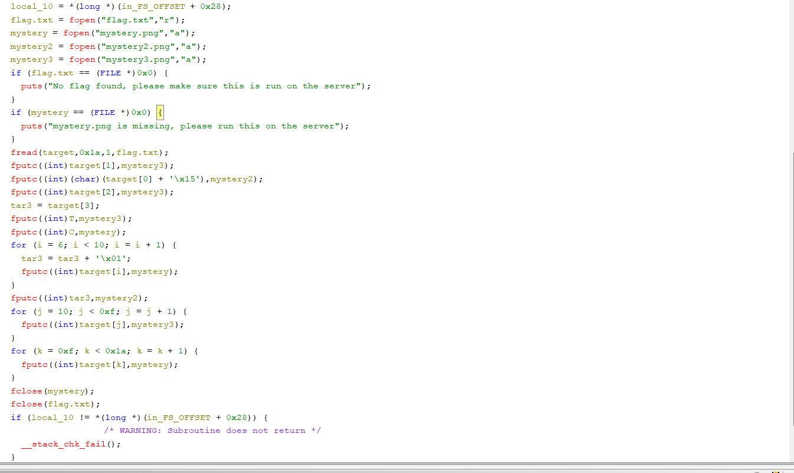

# Investigatibe Reversing 1
# 解説
バイナリファイルと3つの画像ファイルが与えられた。\
3つの画像ファイルに対して`binwalk`をかけると、Mysqlの何かが入っていると出てきたため、`dd`で抜いてみた。\
しかし、`file`コマンドで`data`と出たので、誤認と推定。\
続いて`zsteg`を使うと、IENDの後ろに埋め込みが見つかった。
```
tubo@TUBO:/mnt/c/Users/yuki_/Downloads$ zsteg mystery.png
[?] 16 bytes of extra data after image end (IEND), offset = 0x1e873
extradata:0         .. text: "CF{An1_68311242}"
imagedata           .. text: "PPP@@@@@@@@@@@@"
tubo@TUBO:/mnt/c/Users/yuki_/Downloads$ zsteg mystery2.png
[?] 2 bytes of extra data after image end (IEND), offset = 0x1e873
extradata:0         ..

    00000000: 85 73                                             |.s              |
imagedata           .. text: "PPP@@@@@@@@@@@@"
tubo@TUBO:/mnt/c/Users/yuki_/Downloads$ zsteg mystery3.png
[?] 8 bytes of extra data after image end (IEND), offset = 0x1e873
extradata:0         .. text: "icT0tha_"
imagedata           .. text: "PPP@@@@@@@@@@@@"
```
バイナリファイルをghidraで解析すると、flag.txtに書かれていたflagを3つの画像に断片としてそれぞれ埋め込んでいるらしい。\
デコンパイルした内容をそれぞれ読み取っていき、flagを復元していく。



`putc`は第一引数に何を埋め込むか、第二引数にどのファイルに埋め込むかを指定する。（後ろからpushしていく感じなので、indexは気にしなくていい）
`zsteg`で得たflagの断片と、デコンパイルからわかる埋め込んだ順番を対応させていくとflagを得た。`picoCTF{An0tha_1_68311242}`
