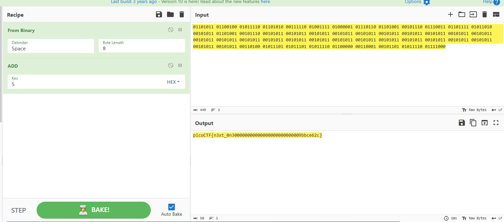

# investigate Reversing 2
## 解説
今回も`investigate rev0 , investigate rev1`同様にバイナリファイルと画像ファイルが与えられた。\
画像拡張子はbmpでヒントにはLSBが使われていると記載があった。\
`Ghidra`を使いデコンパイルすると、登場人物にflag.txt,original.bmp,encoded.bmpがもともとあり、flag.txtの内容をoriginal.bmpに埋め込みencoded.bmp(今回のファイル)を生成しているらしい。

```C
undefined8 main(void)

{
  size_t sVar1;
  long in_FS_OFFSET;
  char original;
  char local_7d;
  int local_7c;
  int i;
  int j;
  int k;
  undefined4 local_6c;
  int value;
  int assert;
  FILE *flag.txt;
  FILE *original.bmp;
  FILE *encoded.bmp;
  char flag [56];
  long local_10;
  
  local_10 = *(long *)(in_FS_OFFSET + 0x28);
  local_6c = 0;
  flag.txt = fopen("flag.txt","r");
  original.bmp = fopen("original.bmp","r");
  encoded.bmp = fopen("encoded.bmp","a");
  if (flag.txt == (FILE *)0x0) {
    puts("No flag found, please make sure this is run on the server");
  }
  if (original.bmp == (FILE *)0x0) {
    puts("original.bmp is missing, please run this on the server");
  }
  sVar1 = fread(&original,1,1,original.bmp);
  local_7c = (int)sVar1;
  value = 2000;
  for (i = 0; i < value; i = i + 1) {
    fputc((int)original,encoded.bmp);
    sVar1 = fread(&original,1,1,original.bmp);
    local_7c = (int)sVar1;
  }
  sVar1 = fread(flag,0x32,1,flag.txt);
  assert = (int)sVar1;
  if (assert < 1) {
    puts("flag is not 50 chars");
                    /* WARNING: Subroutine does not return */
    exit(0);
  }
  for (j = 0; j < 0x32; j = j + 1) {
    for (k = 0; k < 8; k = k + 1) {
      local_7d = codedChar(k,(int)(char)(flag[j] + -5),(int)original);
      fputc((int)local_7d,encoded.bmp);
      fread(&original,1,1,original.bmp);
    }
  }
  while (local_7c == 1) {
    fputc((int)original,encoded.bmp);
    sVar1 = fread(&original,1,1,original.bmp);
    local_7c = (int)sVar1;
  }
  fclose(encoded.bmp);
  fclose(original.bmp);
  fclose(flag.txt);
  if (local_10 == *(long *)(in_FS_OFFSET + 0x28)) {
    return 0;
  }
                    /* WARNING: Subroutine does not return */
  __stack_chk_fail();
}
```

さらに解析を進めると、肝心のflag埋め込み処理の部分を見つけた。

` local_7d = codedChar(k,(int)(char)(flag[j] + -5),(int)original);`

これは、flagをLSBにぶち込めるように加工する関数であり、kの範囲は0-7,jの範囲は0-31となっている。\
kはflagの一文字を2進数で見たときに対応する,0ビット目,1ビット目...の部分でjが文字のインデックスになっている。\
codedChar関数の内容はこうなっている。

```C
byte codedChar(int k,byte flag,byte original)
{
  undefined1 flag;
  
  flag = flag;
  if (k != 0) {
    flag = (byte)((int)(char)flag >> ((byte)k & 0x1f));　//シフトでkビット目をLSBまでもっていってる
  }
  return original & 0xfe | flag & 1;　//シフトした一番右のビットをoriginalのLSBにぶち込む
}
```
これはflagの1文字を2進数としてみて、kビット目をシフトで抽出し、originalのLSBにぶち込むという加工関数になっている。\
例えばflagの一文字目が**p**と仮定すると、`01110000`という2進数になるが、この0ビット目（一番右のビット）は、この関数では加工されない(k != 0だから。でもoriginalのLSBにはぶち込まれる)\
4ビット目の`1`の場合、右に4ビットシフトされ、ほかのビット同様にoriginalのLSBにぶち込まれる。\
このLSBにぶち込む回数は50*8の400回行われているため、encoded.bmpに埋め込まれているのは400バイトになる。

続いて、encoded.bmpのどこに埋め込まれたかについてだが、基本色情報の部分に埋め込まれている。今回は430番地から色情報が始まっている。\
ここで、先ほどのデコンパイルから最初の2000バイトは特に加工もなく`original.bmp`の色情報をそのまま`encoded.bmp`に渡していることが分かる。

```C
value = 2000;
  for (i = 0; i < value; i = i + 1) {
    fputc((int)original,encoded.bmp);
    sVar1 = fread(&original,1,1,original.bmp);
    local_7c = (int)sVar1;
  }
```
ということで、ちょっと進んだあたりを探すと、きっちり400バイトの怪しいバイト列を発見。

```
000007d0: e9e9 e8e9 e8e9 e9e8 e8e8 e9e8 e8e9 e9e8  ................
000007e0: e8e9 e9e9 e9e8 e9e8 e8e9 e8e9 e8e9 e9e8  ................
000007f0: e8e9 e9e9 e9e9 e8e8 e9e9 e9e9 e8e8 e9e8  ................
00000800: e9e8 4e4e 4e4e 4fe8 e8e9 e9e8 e9e9 e9e8  ..NNNNO.........
00000810: e9e8 e8e9 e8e9 e9e8 e8e9 e9e9 e8e9 e8e8  ................
00000820: e9e9 e8e8 e9e9 e9e8 e9e9 e9e9 e8e9 e9e8  ................
00000830: e8e9 e8e9 e9e8 e9e8 e9e9 e8e9 e8e9 e8e8  ................
00000840: e9e8 e8e9 e8e9 e9e8 e8e9 e9e9 e8e9 e8e8  ................
00000850: e9e9 e8e9 e8e9 e8e8 e9e9 e8e9 e8e9 e8e8  ................
00000860: e9e9 e8e9 e8e9 e8e8 e9e9 e8e9 e8e9 e8e8  ................
00000870: e9e9 e8e9 e8e9 e8e8 e9e9 e8e9 e8e9 e8e8  ................
00000880: e9e9 e8e9 e8e9 e8e8 e9e9 e8e9 e8e9 e8e8  ................
00000890: e9e9 e8e9 e8e9 e8e8 e9e9 e8e9 e8e9 e8e8  ................
000008a0: e9e9 e8e9 e8e9 e8e8 e9e9 e8e9 e8e9 e8e8  ................
000008b0: e9e9 e8e9 e8e9 e8e8 e9e9 e8e9 e8e9 e8e8  ................
000008c0: e9e9 e8e9 e8e9 e8e8 e9e9 e8e9 e8e9 e8e8  ................
000008d0: e9e9 e8e9 e8e9 e8e8 e9e9 e8e9 e8e9 e8e8  ................
000008e0: e9e9 e8e9 e8e9 e8e8 e9e9 e8e9 e8e9 e8e8  ................
000008f0: e9e9 e8e9 e8e9 e8e8 e9e9 e8e9 e8e9 e8e8  ................
00000900: e9e9 e8e9 e8e9 e8e8 e9e9 e8e9 e8e9 e8e8  ................
00000910: e9e9 e8e9 e8e9 e8e8 e8e8 e9e8 e9e9 e8e8  ................
00000920: e9e8 e9e9 e9e8 e9e8 e9e8 e9e9 e9e8 e9e8  ................
00000930: e8e9 e9e9 e9e8 e9e8 e8e8 e8e8 e8e9 e9e8  ................
00000940: e9e8 e8e8 e9e9 e8e8 e9e8 e9e9 e8e9 e8e8  ................
00000950: e8e9 e9e9 e9e8 e9e8 e8e8 e8e9 e9e9 e9e8  ................
```
### LSB
e8 = 1110100**0** -> 0 \
e9 = 1110100**1** -> 1


埋め込みは、flagの文字を2進数にした0ビット目（一番右のビット）から始まるため、`01234567 01234567`のような埋め込みの順番になっているはずである。（7が最上位ビット）\
順番に気を付けてLSBを取り出すと、

```
01101011 01100100 01011110 01101010 00111110 01001111 01000001 01110110 01101001 00101110 01110011 01101111 01011010 00101011 01101001 00101110 00101011 00101011 00101011 00101011 00101011 00101011 00101011 00101011 00101011 00101011 00101011 00101011 00101011 00101011 00101011 00101011 00101011 00101011 00101011 00101011 00101011 00101011 00101011 00101011 00101011 00110100 01011101 01011101 01011110 01100000 00110001 00101101 01011110 01111000
```

を得ることができる。

ここで忘れてはいけないのが`flag[j] + -5`を今取り出したことになるため、flagを得るにはasciiに対して5足す必要がある。



よってflagを得た。`picoCTF{n3xt_0n200000000000000000000000009bbce62c}`

## 感想
良問(ﾟ∀ﾟ)ｷﾀｺﾚ!!


