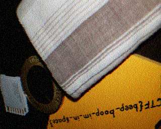
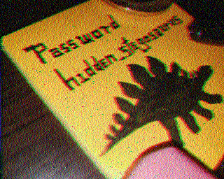
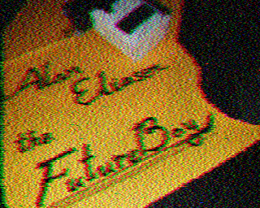

# m00nwalk2
## 解法
SSTVのwavファイルがm00nwalk1同様に与えられた。（今回は4つ与えられた）\
素晴らしいことにオンラインデコーダーがあります。\
https://sstv-decoder.mathieurenaud.fr/ \

復元した画像の中にフラグがあると思ったのですが、これは前回の問題のフラグでした。
ヒントではほかの方法で隠されていると述べられていたため、他のwavファイルに関してもデコードすると、

と明らか怪しそうなパスワードを発見。\
wavファイルはjpgファイルなどと同様にsteghideをかけることができるのでパスワードとして今回の`hidden_stegosaurus`を用いると`steganopayload12154.txt`を落とすことができた。\
中身にflagが入っていた。`picoCTF{the_answer_lies_hidden_in_plain_sight}`