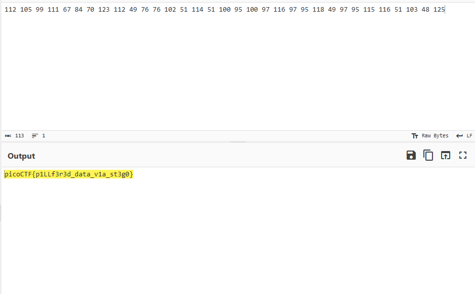

# Shark on wire 2
## 解法
### ※この問題はクソ問です。Forensicsで評価指数が37%と一番低いです。
問題名にもある通りパケットキャプチャの問題です。\
wireshark内でトレースをしてみるとわかるのですが、ダミーの情報がたくさんあります。\
前はパケットを穴が開くほど見て、完敗 -> Writeupをチラ見 -> 見てもわからん という状況だったので、チラ見の記憶をたどって今回は解きました。\
前は怪しいと思わなかったけど、今回怪しむべきはポート番号です。\
知っていないと分からないのですが、ポート番号って大体有名な奴しか使われてないし、5000や22,80など割と整っている数字なのですが、通信の中に5112や5049などかなり気持ち悪いポートを見つけることができます。\
この5049などに対し5000を引くと、asciiの10進数に対応しているというのが今回の問題の核心でした\
正しいポートのことをちゃんと知り、今回のような怪しいポートを探すことがこの問題の趣旨のようですが、はっきり言ってクソ問です。 \
まあ、自分の成長を少し感じることができたのでよしとします。\
\
よってflagを得ました。`picoCTF{p1LLf3r3d_data_v1a_st3g0}`

